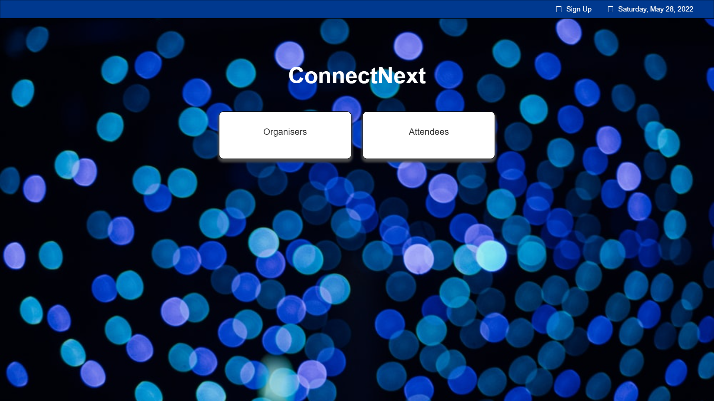
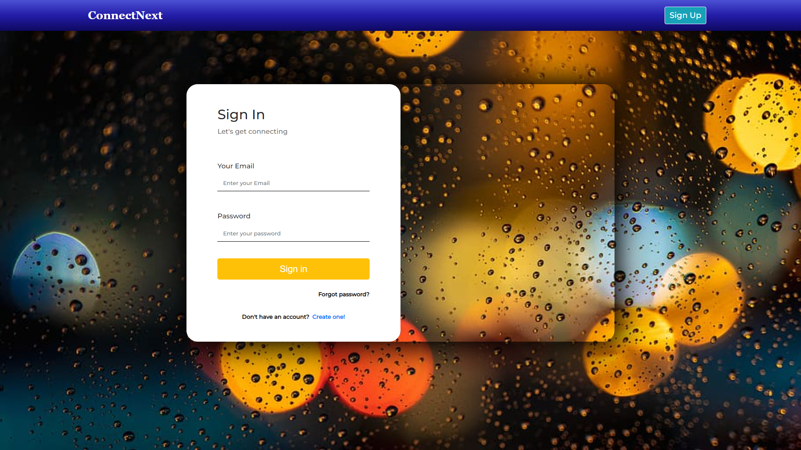
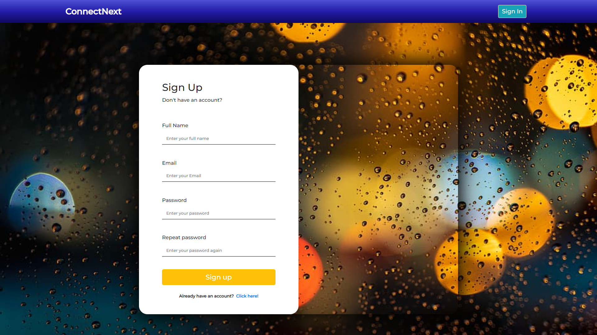
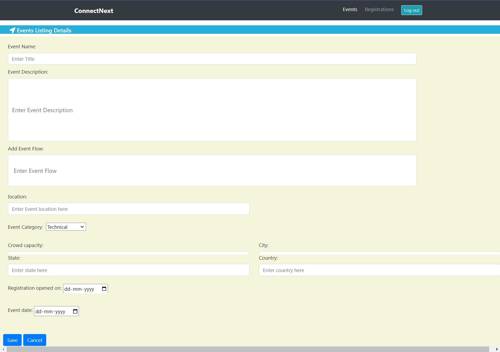
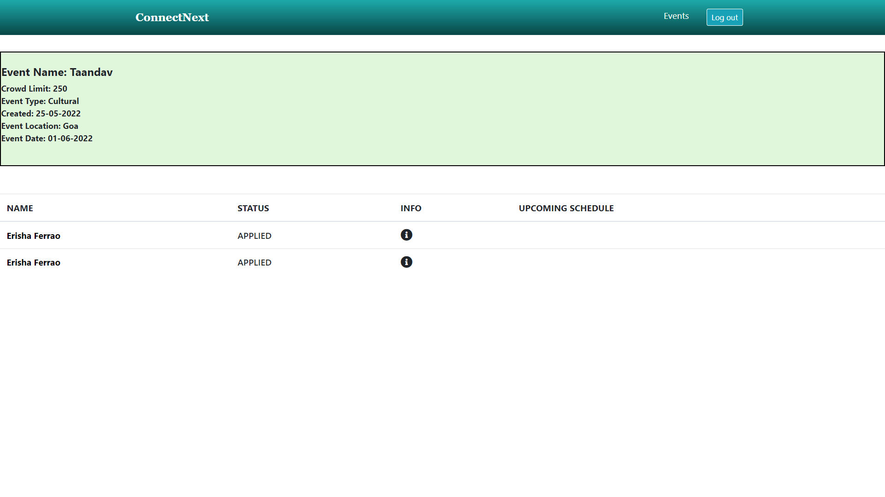
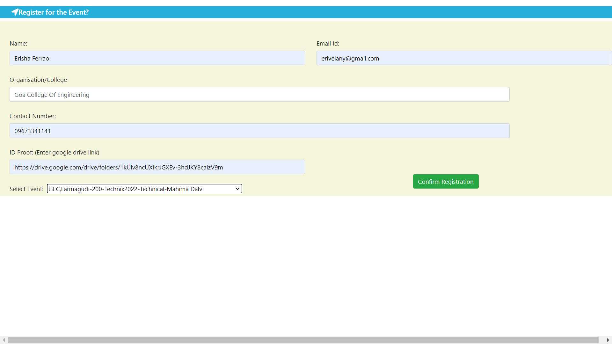
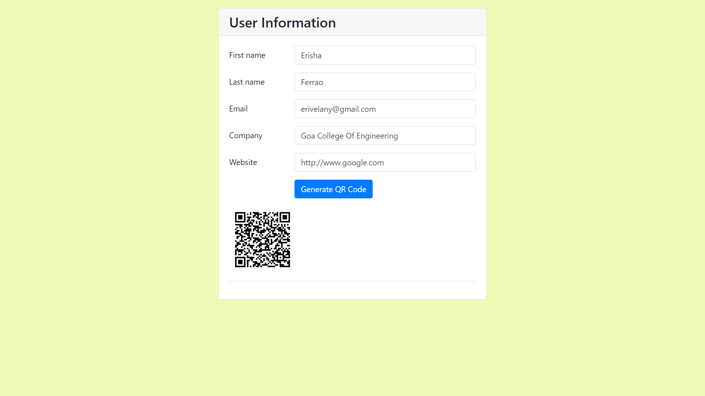
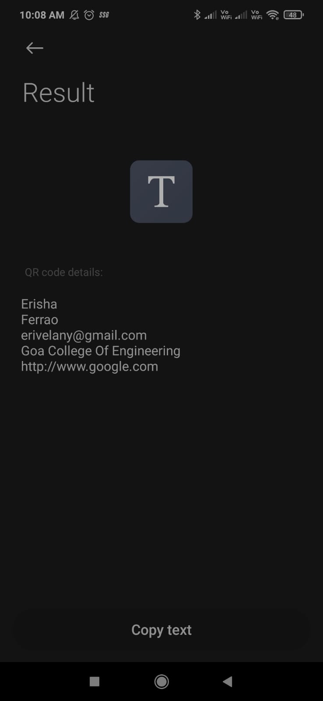

# Techties_07
Covid 19 is here to stay but the number of offline events being organized are increasing. Organizers face issues with respect to crowding and unauthorized entry. Can you hack a solution to help the organizers?


<!-- PROJECT LOGO -->

<p align="center">

<p align="center">
  

  <h3 align="center">One Stop Event-Management Platform </h3>

  <p align="center">
    Suited for a world post covid
     
    
    
  </p>
</p>

While covid-19 has had a negative impact on the events industry, event planners have shown great resilience and adaptibility in finding ways to host events in a post covid world. 
Since events can prove to be major potential vectors for transmission of the virus, it is important to have systems in place to prevent overcrowding at these events & restrict unauthorized entry 

# ConnectNext

ConnectNext is a one stop event management platform for organizers & atendees in a world post covid.
Organizers can create one or multiple events on the platform.
Atendees on the other hand can view all the events near them & register for them. 


<!-- TABLE OF CONTENTS -->
<details open="open">
  <summary>Table of Contents</summary>
  <ol>
    <li>
      <a href="#about-the-project">About The Project</a>
      <ul>
        <li><a href="#features">Features</a></li>
        <li><a href="#built-with">Built With</a></li>
      </ul>
    </li>
    <li>
      <a href="#navigating-through">Navigating Through</a>
      <ul>
        <li><a href="#Organizers">Organizers</a></li>
        <li><a href="#Atendees">Atendees</a></li>
      </ul>
    </li>
    
  </ol>
</details>


<!-- ABOUT THE PROJECT -->
## About The Project

Oranizers can "create an event" on the ConnectNext platform. Atendees can then register for events of their interest.
Organizers can set a "venue capacity" to restrict the form responses & prevent overcrowding.
Once an antendee registers for an event, they are sent a confirmation mail & a QR Code which is required for entry to the venue. Atendees are prompted to carry a valid ID
The QR code has the individuals name & details encoded in it & can be read using any basic QR code scanner.
This simple method can be used to verify people at the time of entry & prevent unauthorized entry.

Advantages of the platform:
* Prevent overcrowding / crowd-control
* Prevents unauthorized entry
* Organizers can easily create multiple events
* allows organizers keep track of responses
* Allows for Direct line of Communication between organizers and atendees
* Atendees can reminded to follow required covid protocols


### Features

Some of the major features of the site include
* QR Code Generator : to verify atendees
* Counter : to set crowd capacity
* Auto Mail: Mail sent to users on sucessful registration & for QR code
* Easy to use Template for event creation
* Registration form
* Sign in/ Sign up pages 

### Built With

This project was built using a LAMP stack
* HTML
* CSS
* JavaScript
* JQuery
* MySql
* PHP


<!-- GETTING STARTED -->
## Navigating through

1. Landing Page
<br/>
  <br><br>
  
2. Sign-in Page
 <br/>
  <br><br>
  
3. Sign-up Page
  <br/>
  <br><br>


### Organizers


1. Events List

Upon signing-in as an Organizer, the organizer is able to view all the events scheduled by the organization

Features of the page:
* Create new event
* Compact view of scheduled event details
* Delete event
* View details of each event on click

<br/>
  <br><br>

2. Creating a new event

on clicking "create new event"

Features of the page
* Easy to use template to create events


<br/>
  <br><br>

3. Viewing each event

 The organizers can view all the details  of the event by clicking on each event 
 
 Features of the page
 * Event Details
 * Atendee details

<br/>
  <br><br>
```


### Atendees

1. Registration form

Upon Signing-In, atendees are taken to a registration form to register for an event

Features of the page:

* drop down to select the event
* attachment of ID proof

<br/>
  <br><br>

2. Generation of QR code for each atendee

on submitting the registration form, the attendees will generate the QR code which will be needed for entry to the event

<br/>
  <br><br>
  
  On scanning the QR code
  
<br/>
  <br><br>

